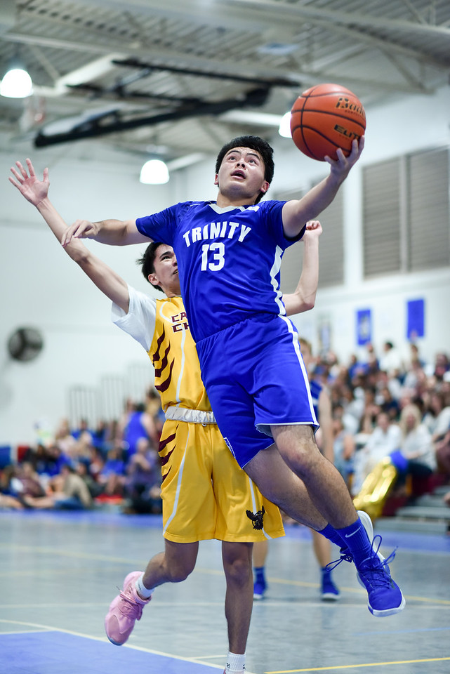

The road to the championship game was a hard one and everyone knew it. It was required of us to be at the top school in the league. It is important to note that this team has never been beaten by my school in the history of the league and that this team was the reigning champions for the past 3 years. The team knew we had to train every day and put in the work both on the court and off the court to topple the reigning champions. Each of us was expected to put in hours during the summer getting shooting reps and keeping in condition. In addition to the normal ones, we also were weight training to strengthen our jumping power for rebounding. Over the course of the year, we eventually became much more polished and gelled as a team. This eventually led to us getting to championships and bringing home the first basketball championship in the school's history.

Even though these were the main things that were expectant of the team which included me, I also had to undertake much more responsibilities since I was the team captain. Being the team captain, I was the main motivator for the team. One could also say the spark. Another job of mine was to go over the videos with the coach before and after the game to figure out things to beat our opponents. These were the main contributions that I was to bring off the court or in the practice setting. On the court, I was the point guard. At all times I needed to be observant. According to what the defense was showing, I would need to change up the play or call out a different formation altogether. Since I was a point guard, this also meant that I needed good awareness and positioning to feed the other players, allowing them to get the easy buckets. 

Because of my position on and off the court, I learned how to work together and help other people work together toward a common goal despite some of them having issues with each other. After winning the championship, it was extremely evident that with dedication and will there is nothing that can not be done. This is due in part to my school starting out winning zero games 4 years prior to becoming the champions years later. The final main thing that I took from this experience was getting comfortable in the leadership role. As a leader, it is good to understand not only how the plan will go but also who are the people who will be executing the plan. At the end of the day, it is the people who will be doing the plan. If the plan is not really tailored to the people then the maximum output can not always be achieved. You need to get to know the people as well as what motivates and helps them understand the problem at hand. Only by understanding the people working on the plan will the plan truly succeed and the goal be reached. 
