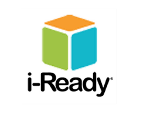

During the Summer of 2023, I took charge of preparing the technology for the upcoming school year at Ka'elepulu Elementary School as the sole Technology Coordinator. I was responsible for a comprehensive range of tasks to ensure everything was fully operational by the first day of school.

## Chromebook Configuration and Deployment
My first major task was updating the Chromebooks with the latest OS versions. Using Google Admin, I streamlined the OS updates across all devices and organized them into specific units to meet the testing standards. This meticulous configuration ensured that each Chromebook was appropriately set up for various classroom needs.

## WiFi Network Optimization and Troubleshooting
As the number of students increased, I focused on optimizing the WiFi network to handle the higher demand. When connectivity issues emerged, I systematically investigated by testing other Chromebooks to pinpoint the problem. I then adjusted settings and performed device resets as needed, ensuring robust and reliable network performance.

## Software Integration and User Access Management
Part of the setup involved configuring iREADY to accommodate different login methods. For younger students, I enabled QR code access to simplify their login process, while also ensuring older students could securely use their passwords. This approach required careful integration to support diverse user needs efficiently.

## Time Management and Project Planning
Balancing these responsibilities required effective time management and strategic planning. I developed a detailed schedule to complete each task on time, prioritizing critical updates and troubleshooting to ensure a smooth launch.

## Adaptation to Chrome OS and Technical Troubleshooting
Transitioning to Chrome OS presented new challenges. I quickly adapted to its unique features and troubleshooting methods, which involved performing resets or troubleshooting specific issues to maintain optimal device performance.

By carefully managing each aspect of the technology setup—from hardware updates and network optimization to software integration and user access—I ensured that all systems were ready for the academic year. This holistic approach to technology management provided a solid foundation for a successful start to the school year.
