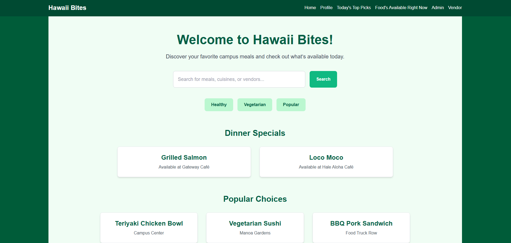
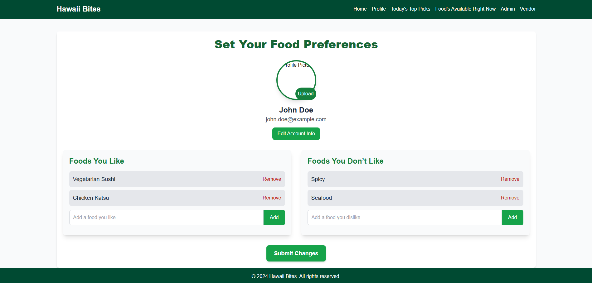

# Your better Search for Food Around Campus
Hawaii Bites was born out of a shared vision to simplify the often overwhelming process of finding food on campus. As students ourselves, we experienced the frustration of not knowing what was available, where to find it, or even whether our favorite meals were being served. This project aimed to address those challenges by creating a centralized platform that connects the University of Hawaii at Manoa community with campus dining options. By combining a clean, intuitive user interface with robust backend support, Hawaii Bites not only makes it easier for users to discover meals but also empowers vendors to update menus effortlessly. Whether you’re a student in a hurry, a vendor looking to engage more customers, or an admin managing the system, Hawaii Bites ensures that everyone benefits from a streamlined, accessible, and personalized dining experience.

Currently still under construction but a sample of the current application can be found [here](https://hawaii-bites.vercel.app/login).

Use credentials test@hawaii.edu for the username and TestPassword123 for password.

## Contributions:
Frontend, Backend, and Testing: The development of Hawaii Bites leveraged a full-stack approach to create a seamless and interactive platform. The frontend, built with Next.js, provided an intuitive and responsive user interface, featuring key components like personalized user dashboards, vendor-specific pages, and admin controls. On the backend, Supabase was used for database management and secure user authentication, enabling features like role-based access for users, vendors, and admins. Comprehensive testing using Playwright ensured robust performance across all functionalities, including login systems, menu updates, and filtering options. This combined effort across the frontend, backend, and testing phases resulted in a reliable and user-friendly application that met the diverse needs of the campus community.

## Lessons Learned:
Full-Stack Development and User-Centric Design: Building Hawaii Bites underscored the importance of seamless integration between the frontend and backend to provide a smooth user experience. Iterative testing and coordination between the teams were crucial to achieving this balance. User feedback highlighted the value of personalized and intuitive features, such as customizable profiles and detailed vendor pages, which enhanced user engagement. Managing the scalability of the system while accommodating multiple user roles demonstrated the necessity of a well-structured backend architecture. Additionally, leveraging GitHub’s organizational tools streamlined collaboration, enabling efficient workflow management and feature development. Thorough testing further emphasized the importance of identifying and resolving potential issues before deployment, ensuring a polished and reliable final product. Collectively, these experiences deepened the team’s understanding of full-stack development while reinforcing the significance of user-centric design in building impactful applications.

## Sample Screenshots of Application:

  
  

## GitHub Organization Page
To learn more about the source code and view the github repsoitory associated with the source code, visit the [Hawaii Bites GitHub Organization Page](https://hawaii-bites.github.io/).
